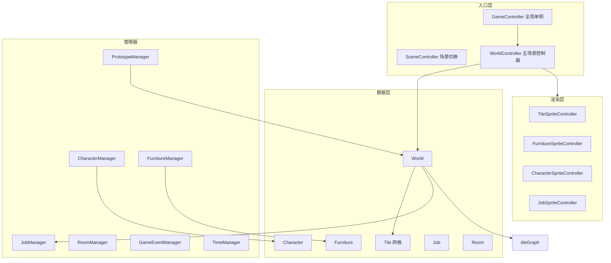

# Project Porcupine 框架分析与后续步骤

## 一、整体架构

---

## 二、核心模块详解

### 2.1 入口与控制器

| 文件                                                                                   | 职责                                                                     |
| ------------------------------------------------------------------------------------ | ---------------------------------------------------------------------- |
| [GameController.cs](ProjectPorcupine/Assets/Scripts/Controllers/GameController.cs)   | 全局单例，DontDestroyOnLoad，管理暂停、音效、键盘                                      |
| [SceneController.cs](ProjectPorcupine/Assets/Scripts/Controllers/SceneController.cs) | 静态类，场景加载（MainMenu、_World）                                              |
| [WorldController.cs](ProjectPorcupine/Assets/Scripts/Controllers/WorldController.cs) | 主场景根，持有 World、各 SpriteController、BuildModeController、MouseController 等 |

### 2.2 世界与网格

| 文件                                                                                 | 职责                                             |
| ---------------------------------------------------------------------------------- | ---------------------------------------------- |
| [World.cs](ProjectPorcupine/Assets/Scripts/Models/Area/World.cs)                   | 3D Tile 数组、Path_TileGraph、JobManager、温度、房间、可见性 |
| [Tile.cs](ProjectPorcupine/Assets/Scripts/Models/Buildable/Tile.cs)                | 单格数据，TileType、Furniture、Inventory              |
| [TileType](ProjectPorcupine/Assets/Scripts/Models/Buildable/TileType.cs)           | 格类型（empty、floor、ladder）                        |
| [WorldGenerator.cs](ProjectPorcupine/Assets/Scripts/Models/Area/WorldGenerator.cs) | 世界生成                                           |

### 2.3 建筑（Furniture）

| 文件                                                                                                       | 职责                                           |
| -------------------------------------------------------------------------------------------------------- | -------------------------------------------- |
| [Furniture.cs](ProjectPorcupine/Assets/Scripts/Models/Buildable/Furniture.cs)                            | 家具/建筑，组件化（PowerConnection、Workshop 等），Lua 扩展 |
| [FurnitureManager.cs](ProjectPorcupine/Assets/Scripts/Models/Buildable/FurnitureManager.cs)              | 家具集合                                         |
| [BuildModeController.cs](ProjectPorcupine/Assets/Scripts/Controllers/InputOutput/BuildModeController.cs) | 建造模式，放置逻辑                                    |
| [OrderMenu](ProjectPorcupine/Assets/Scripts/UI/InGameUI/MenuLeft/)                                       | 建造菜单、OrderAction                             |

### 2.4 角色与寻路

| 文件                                                                                          | 职责                                               |
| ------------------------------------------------------------------------------------------- | ------------------------------------------------ |
| [Character.cs](ProjectPorcupine/Assets/Scripts/Models/Character/Character.cs)               | 角色，状态机（JobState、MoveState、HaulState、IdleState 等） |
| [CharacterManager.cs](ProjectPorcupine/Assets/Scripts/Models/Character/CharacterManager.cs) | 角色集合                                             |
| [Pathfinder.cs](ProjectPorcupine/Assets/Scripts/Pathfinding/Pathfinder.cs)                  | 静态 A* 入口                                         |
| [Path_TileGraph.cs](ProjectPorcupine/Assets/Scripts/Pathfinding/Path_TileGraph.cs)          | Tile 寻路图                                         |
| [Path_RoomGraph.cs](ProjectPorcupine/Assets/Scripts/Pathfinding/Path_RoomGraph.cs)          | 房间级寻路                                            |

### 2.5 任务系统

| 文件                                                                                    | 职责         |
| ------------------------------------------------------------------------------------- | ---------- |
| [Job.cs](ProjectPorcupine/Assets/Scripts/Models/Job/Job.cs)                           | 任务（建造、搬运等） |
| [JobManager.cs](ProjectPorcupine/Assets/Scripts/Models/Job/JobManager.cs)             | 任务队列、分配    |
| [BuildableJobs.cs](ProjectPorcupine/Assets/Scripts/Models/Buildable/BuildableJobs.cs) | 建造相关 Job   |

### 2.6 房间

| 文件                                                                                | 职责        |
| --------------------------------------------------------------------------------- | --------- |
| [Room.cs](ProjectPorcupine/Assets/Scripts/Models/Area/Room.cs)                    | 房间数据      |
| [RoomManager.cs](ProjectPorcupine/Assets/Scripts/Models/Area/RoomManager.cs)      | 房间集合、区域划分 |
| [RoomBehavior.xml](ProjectPorcupine/Assets/StreamingAssets/Data/RoomBehavior.xml) | 房间行为配置    |

### 2.7 事件与时间

| 文件                                                                                       | 职责                              |
| ---------------------------------------------------------------------------------------- | ------------------------------- |
| [GameEventManager.cs](ProjectPorcupine/Assets/Scripts/Models/Events/GameEventManager.cs) | 游戏事件                            |
| [TimeManager.cs](ProjectPorcupine/Assets/Scripts/Models/Time/TimeManager.cs)             | 时间、暂停、EveryFrame/FixedFrequency |
| [ScheduledEvent](ProjectPorcupine/Assets/Scripts/Models/Scheduler/)                      | 定时事件                            |

### 2.8 配置与数据

| 路径                                                                                                 | 用途       |
| -------------------------------------------------------------------------------------------------- | -------- |
| [StreamingAssets/Data/Tiles.xml](ProjectPorcupine/Assets/StreamingAssets/Data/Tiles.xml)           | 格类型      |
| [StreamingAssets/Data/Furniture.xml](ProjectPorcupine/Assets/StreamingAssets/Data/Furniture.xml)   | 家具原型     |
| [StreamingAssets/Data/GameEvents.xml](ProjectPorcupine/Assets/StreamingAssets/Data/GameEvents.xml) | 游戏事件     |
| [StreamingAssets/Data/Inventory.xml](ProjectPorcupine/Assets/StreamingAssets/Data/Inventory.xml)   | 物品       |
| [StreamingAssets/WorldGen/](ProjectPorcupine/Assets/StreamingAssets/WorldGen/)                     | 世界生成配置   |
| [StreamingAssets/LUA/](ProjectPorcupine/Assets/StreamingAssets/LUA/)                               | Lua 脚本扩展 |

---

## 三、可精简/可砍模块（魔王地下城不需要）

| 模块                          | 说明         | 建议            |
| --------------------------- | ---------- | ------------- |
| TemperatureDiffusion        | 温度扩散       | 砍             |
| PowerNetwork / FluidNetwork | 电力、流体      | 砍或极简          |
| Ship / Trader               | 飞船、商人      | 改为「勇者来袭」事件    |
| Need / NeedState            | 角色需求（饥饿等）  | 砍或极简          |
| Quest                       | 任务系统       | 可砍，或简化为「收集灵魂」 |
| ModsManager / Lua           | Mod、Lua 扩展 | 可延后保留         |
| Atmosphere                  | 气体、压力      | 砍             |

---

## 四、魔王地下城映射

| Project Porcupine | 魔王地下城                  |
| ----------------- | ---------------------- |
| Character（工人）     | 勇者（敌对）或 怪物（己方）         |
| Furniture（家具）     | 房间、陷阱、魔王房              |
| Job（建造任务）         | 建造房间；勇者无 Job，改为「穿越+战斗」 |
| Room              | 宝藏房、陷阱房、怪物房、魔王房        |
| GameEvent         | 勇者来袭、商人                |
| Tile（floor）       | 地下城走廊、房间地面             |
| TradeController   | 简化为灵魂/金币交易             |

---

## 五、后续步骤（按顺序）

### Phase 1：熟悉与精简（1–2 周）

1. **运行项目**：在 Unity 中打开 `_World` 场景，确认可正常跑通
2. **通读核心**：World、Tile、Furniture、Character、Pathfinder、JobManager
3. **精简模块**：移除或禁用 Temperature、Power、Fluid、Ship 等非必要系统
4. **主题替换**：将太空主题改为地下城（Tiles.xml 增加地下城地面，Furniture.xml 增加房间/陷阱）

### Phase 2：勇者与战斗（2–3 周）

1. **勇者角色**：基于 Character 新建 Hero 或复用 Character，设为「敌对」阵营
2. **勇者 AI**：简化状态机为「寻路 → 进入房间 → 触发战斗/陷阱」，参考 KeeperFX 英雄行为
3. **战斗结算**：房间危险度 vs 勇者生命，死亡→灵魂，生还→伤口
4. **灵魂/伤口**：新增 GameState 或扩展现有 Currency，实现胜负条件

### Phase 3：房间与吸引（2–3 周）

1. **房间类型**：Furniture 或 Room 扩展，支持宝藏房、陷阱房、怪物房、魔王房
2. **吸引力**：参考 KeeperFX，财富/宝藏吸引勇者；每轮按吸引力数量生成勇者事件
3. **陷阱**：Furniture 组件或新类型，堆叠在房间上增加危险度
4. **勇者来袭事件**：用 GameEvent/ScheduledEvent 驱动，替代 Ship/Trader

### Phase 4：经济与 UI（1–2 周）

1. **灵魂/金币**：扩展现有 Currency、Inventory
2. **建造成本**：房间建造消耗灵魂/材料，修改 Furniture OrderAction
3. **UI 调整**：主菜单、建造菜单、灵魂/伤口/金币显示
4. **胜利/失败**：检测灵魂≥10 或伤口≥5，弹出结算

### Phase 5：打磨与扩展（持续）

1. **挂机节奏**：TimeManager 调速、离线收益（可选）
2. **阶段/关卡**：多地图、渐进解锁
3. **魔王装备、城镇发展**：Phase 2 设计中的扩展

---

## 六、关键文件速查

| 需求    | 查阅文件                                            |
| ----- | ----------------------------------------------- |
| 网格/地图 | World.cs, Tile.cs, TileSpriteController.cs      |
| 建造放置  | BuildModeController.cs, Furniture.cs, OrderMenu |
| 寻路    | Pathfinder.cs, Path_TileGraph.cs, Path_AStar.cs |
| 角色移动  | Character.cs, MoveState.cs                      |
| 任务    | Job.cs, JobManager.cs                           |
| 事件    | GameEventManager.cs, GameEvents.xml             |
| 房间    | Room.cs, RoomManager.cs, RoomBehavior.xml       |
| 配置    | StreamingAssets/Data/*.xml                      |

---

## 七、技术栈与依赖

- **Unity**：见 ProjectSettings
- **MoonSharp**：Lua 脚本
- **Newtonsoft.Json**：JSON 解析
- **Scheduler**：外部包，时间调度
- **GPL-3.0**：注意协议

