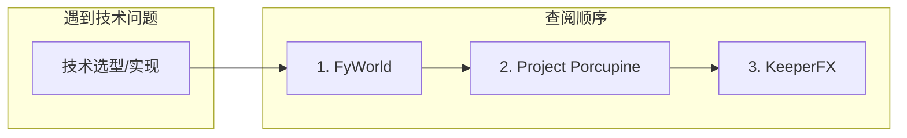

# 技术栈与参考项目方案

## 一、项目角色定义

| 角色         | 项目                                                                     | 用途                      |
| ---------- | ---------------------------------------------------------------------- | ----------------------- |
| **开发基础**   | [FyWorld](https://github.com/Fy-/FyWorld)                              | Fork 作为起点，提供网格建造、基地管理框架 |
| **技术参考 A** | [Project Porcupine](https://github.com/TeamPorcupine/ProjectPorcupine) | 网格、寻路、角色、事件等系统实现参考      |
| **技术参考 B** | [KeeperFX](https://github.com/dkfans/keeperfx)                         | 地城守護者玩法、房间、陷阱、吸引机制参考    |

---

## 二、各项目概览

### FyWorld（基础）

- **技术栈**：Unity、C#、GPL-3.0
- **类型**：奇幻中世纪基地建造，RimWorld-like 教程项目
- **特点**：体量适中、有教程、奇幻题材接近魔王地下城
- **提供**：网格、建筑放置、角色、基础 UI

### Project Porcupine（参考 A）

- **技术栈**：Unity、C#、XML/Lua、GPL-3.0
- **类型**：太空基地建造，RimWorld/Dwarf Fortress 风格
- **特点**：系统完整，有 [Wiki](https://github.com/TeamPorcupine/ProjectPorcupine/wiki) 文档
- **可参考**：Pathfinding、Jobs、Events、Furniture 组件、Agent 行为

### KeeperFX（参考 B）

- **技术栈**：C/C++，需原版地城守護者资源
- **类型**：地城守護者开源重制与扩展
- **特点**：玩法与魔王题材高度相关
- **可参考**：房间类型、陷阱、英雄吸引、怪物行为、经济循环（设计层面，非直接复用代码）

---

## 三、技术方案选择时的查阅顺序

遇到技术选型或实现问题时，按以下顺序查阅：

| 问题类型         | 优先查阅                         | 说明                         |
| ------------ | ---------------------------- | -------------------------- |
| **网格/地图**    | FyWorld → Project Porcupine  | 两者均为 Unity 网格，FyWorld 更轻   |
| **寻路**       | Project Porcupine            | 有 Room Based、Heuristic 等实现 |
| **建筑放置**     | FyWorld → Project Porcupine  | 放置逻辑、碰撞、区域                 |
| **角色/单位 AI** | Project Porcupine → FyWorld  | Agent、Jobs、移动              |
| **房间/区域**    | KeeperFX → Project Porcupine | 房间类型、功能、吸引逻辑               |
| **陷阱/机关**    | KeeperFX                     | 地城守護者陷阱设计                  |
| **英雄吸引**     | KeeperFX                     | 财富、宝藏吸引英雄的机制               |
| **经济/资源**    | KeeperFX → Project Porcupine | 金币、灵魂、建造成本                 |
| **事件/时间**    | Project Porcupine            | Scheduler、Events           |
| **UI/布局**    | FyWorld → Project Porcupine  | 两者均有代码化 UI                 |

---

## 四、与现有设计的关系

当前计划为 **Stacklands 卡牌向**。若以 FyWorld 为基础：

- **需要调整**：卡牌堆叠 → 网格建造；操作区 → 地下城地图
- **可保留**：灵魂/伤口、吸引力/危险度、胜负条件、勇者类型
- **可融合**：资源/合成仍可用简化 UI（非卡牌），或保留部分卡牌用于资源管理

建议在 Fork FyWorld 后，单独做一次「从卡牌到网格」的迁移设计。

---

## 五、实施步骤建议

1. **Fork FyWorld** 到本地/组织仓库
2. **通读** FyWorld 的网格、建筑、角色相关代码
3. **建立参考索引**：将 Project Porcupine、KeeperFX 的关键文件/模块整理成速查表
4. **确定迁移范围**：明确哪些沿用 FyWorld，哪些参考 Project Porcupine/KeeperFX 重写
5. **替换主题**：将奇幻基地改为魔王地下城（房间、陷阱、勇者、灵魂等）

