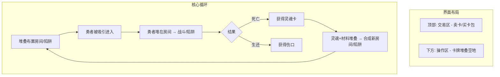

# 魔王杀勇者：游戏框架（Stacklands 向）

## 一、核心定位

**一句话**：玩家扮演魔王，通过**卡牌堆叠**布置地下城、吸引勇者、消灭勇者收割灵魂，在「吸引 vs 消灭」的张力中挂机推进。

**设计锚点**：**Stacklands（堆叠大陆）**——卡牌堆叠操作、合成配方、简洁卡通美术、触屏友好。

**目标平台**：移动端优先，PC 可移植；单机为主。

---

## 二、整体框架

---

## 三、Stacklands 式设计规范

### 3.1 美术风格（已确认）

- **简洁卡通**：手绘 2D、色彩明快、卡牌绘制精美
- **极简界面**：画面干净，无多余 UI
- **卡牌动画**：卡牌有物理感（如灵魂卡闪烁、勇者卡移动），让静态卡牌有生气
- **魔王题材适配**：偏暗色调，保留简洁与卡通感；可选光照/法线增强氛围

### 3.2 操作方式（已确认）

- **核心：拖拽 + 堆叠**：将卡牌拖至另一张卡牌上触发操作
- **堆叠即操作**：无额外按钮，堆叠即执行
- **界面布局**：
  - **顶部**：交易区（卖卡换金币、用金币买卡包）
  - **下方**：操作区（空地，卡牌自由堆叠布置）

### 3.3 视角（已确认）

- **俯视棋盘/空地**：类似 Stacklands，无复杂地图，以卡牌堆叠区域为主
- 可选：简单背景（地下城剪影、城镇剪影）区分区域，不喧宾夺主

---

## 四、卡牌体系

### 4.1 卡牌类型

| 类型           | 代表内容            | 堆叠规则示例          |
| ------------ | --------------- | --------------- |
| **勇者卡**      | 进入地下城的勇者        | 勇者堆在房间卡 → 进入/战斗 |
| **房间卡**      | 宝藏房、陷阱房、怪物房、魔王房 | 陷阱卡堆在房间卡 → 布置陷阱 |
| **灵魂卡**      | 击杀勇者获得          | 灵魂+材料堆叠 → 合成新卡  |
| **材料卡**      | 金币、骨头、碎片等       | 参与合成、可卖         |
| **配方卡（主意卡）** | 合成配方            | 解锁后可执行对应合成      |
| **装备卡**      | 魔王装备（Phase 2）   | 堆在魔王卡上 → 装备     |
| **建筑卡**      | 城镇建筑（Phase 2）   | 城镇区域堆叠建造        |

### 4.2 堆叠触发规则（核心）

| 堆叠组合             | 触发效果             |
| ---------------- | ---------------- |
| 勇者 + 宝藏房         | 勇者进入，按危险度结算      |
| 勇者 + 陷阱房         | 触发陷阱，按数值结算       |
| 勇者 + 怪物房         | 战斗，按数值结算         |
| 勇者 + 魔王房         | 魔王迎战，结算灵魂/伤口     |
| 陷阱卡 + 房间卡        | 房间获得陷阱，危险度 +N    |
| 灵魂 + 材料 A + 材料 B | 若满足配方 → 合成新房间/陷阱 |
| 卡牌 + 顶部交易区       | 卖出，获得金币          |
| 金币 + 卡包          | 购买，获得随机卡牌        |

### 4.3 合成配方（主意卡）

**示例**：

- 1 灵魂 + 2 骨头 + 1 石头 → 陷阱房
- 2 灵魂 + 1 木头 + 1 铁 → 怪物房
- 1 灵魂 + 1 金币 → 宝藏房（+吸引）
- 3 灵魂 + 配方卡「尖刺陷阱」 → 尖刺陷阱卡

配方通过「主意卡」解锁：完成任务、购买卡包、或阶段推进获得。

---

## 五、核心机制（保留）

### 5.1 吸引力 vs 危险度

- **吸引力**：宝藏房、诱饵卡等 → 决定勇者「来不来」（每轮进入的勇者数量）
- **危险度**：陷阱、怪物强度、房间组合 → 决定勇者「死不死」

**策略张力**：高吸引 + 低危险 = 勇者多但易生还（伤口多）；低吸引 + 高危险 = 勇者少但易死（灵魂少）。

### 5.2 资源与胜负

| 资源  | 来源      | 用途               |
| --- | ------- | ---------------- |
| 灵魂  | 勇者死亡    | 合成、购买、胜利条件       |
| 伤口  | 勇者生还    | 魔王生命减少，累积致死 = 失败 |
| 金币  | 卖卡、勇者掉落 | 买卡包、部分合成         |

| 条件             | 结果          |
| -------------- | ----------- |
| 收集 N 个灵魂（如 10） | 胜利          |
| 伤口累积致死         | 失败          |
| 勇者池耗尽          | 游戏结束，按灵魂数结算 |

### 5.3 勇者系统

- **勇者池**：城镇/牌库中有若干勇者卡；每轮按吸引力数量从牌库翻面进入操作区
- **勇者强度**：随时间或轮次缓慢成长
- **勇者类型**：可简化为 2–3 种（战士/法师/盗贼），影响对陷阱/怪物的抗性

---

## 六、挂机节奏

| 操作     | 频率   | 说明                   |
| ------ | ---- | -------------------- |
| 拖拽堆叠卡牌 | 随时   | 布置、合成、卖卡             |
| 查看挂机进度 | 随时   | 灵魂/伤口/勇者数            |
| 买卡包    | 有金币时 | 顶部交易区                |
| 领取离线收益 | 回归时  | 挂机时长换算灵魂/金币（Phase 2） |

**挂机化**：勇者按吸引力自动「翻面进入」操作区，玩家可手动堆叠触发战斗，或设自动堆叠（勇者自动堆到第一个房间）。

---

## 七、MVP 范围（4–6 周）

### 必须实现

1. **卡牌堆叠**：拖拽、堆叠触发、基础物理感
2. **3 种房间卡**：宝藏房、陷阱房、怪物房（+魔王房）
3. **勇者卡**：2–3 种，每轮按吸引力进入
4. **灵魂/伤口**：杀勇者得灵魂，生还得伤口；10 灵魂胜利，伤口致死失败
5. **合成**：至少 3–5 个配方（新房间、陷阱）
6. **交易区**：卖卡换金币、买卡包
7. **简洁卡通美术**：Stacklands 风格，偏暗色调

### 延后（Phase 2）

- 魔王亲自下场 + 装备卡
- 勇者城镇发展 + 选择性放生
- 离线收益
- 5–10 阶段/关卡、渐进解锁
- 多地图/多难度

---

## 八、10 小时内容支撑（完整版）

| 阶段   | 目标灵魂       | 解锁内容          | 预估时长     |
| ---- | ---------- | ------------- | -------- |
| 1    | 10         | 基础 3 房间、3 配方  | 1–1.5 小时 |
| 2–3  | 15, 20     | 新陷阱、新怪物、新配方   | 2–3 小时   |
| 4–6  | 25, 30, 40 | 新房间、魔王装备、城镇建筑 | 3–4 小时   |
| 7–10 | 50+        | 高级机制、Boss 勇者  | 2–3 小时   |

**开发策略**：先做「阶段框架」和「配方解锁钩子」，再按阶段填充内容。

---

## 九、参考游戏速查

| 游戏                   | 核心借鉴                         |
| -------------------- | ---------------------------- |
| **Stacklands（堆叠大陆）** | 卡牌堆叠操作、合成配方、简洁卡通美术、界面布局、触屏友好 |
| 地城守護者                | 吸引机制、陷阱、经济循环                 |
| Dungeon Maker        | 魔王防御、房间布置、勇者路径               |
| 剑与远征                 | 挂机循环、离线收益                    |

---

## 十、技术实现与代码参考

### 10.1 第一版代码参考

**[StacklandsLike](https://github.com/VM233/StacklandsLike)**（三角杯 Game Jam 作品）

- **技术栈**：Unity、C#、ShaderLab、HLSL
- **内容**：Stacklands 式卡牌堆叠 Demo，含拖拽、堆叠、合成等基础实现
- **用途**：第一版开发可参考其卡牌拖拽、堆叠逻辑、UI 布局与数据结构
- **协议**：GPL-3.0

### 10.2 技术栈建议

- **引擎**：Unity（与 StacklandsLike 一致，便于复用）
- **核心模块**：卡牌拖拽、堆叠检测、合成配方系统、交易区 UI
- **风格**：2D 简洁卡通，可选光照/法线增强

---

## 十一、与现有项目的关系

- **可独立**：作为新项目，与传奇地形无强依赖
- **代码起点**：可 Fork 或参考 [StacklandsLike](https://github.com/VM233/StacklandsLike)，在其基础上替换为魔王地下城玩法
- **风格**：2D 简洁卡通，可选光照/法线增强

